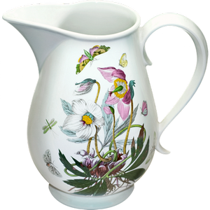
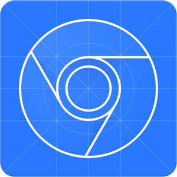

# Hi there, I'm Bogdan Gatsyuk 👋

a QA with over 5+ years of experience ensuring software quality and building automated testing frameworks

* :telescope: I am currently working on automated regression suites, CI/CD pipeline integration, and improving test coverage for [LastFlag](https://www.youtube.com/@PlayLastFlag).
* :memo: I write technical documentation and testing strategies on [LinkedIn](https://www.linkedin.com/in/bogdan-gatsyuk-a0a7a11bb/).
* :speech_balloon: Ask me about *test automation*, *bug life cycle management*, and *API testing* (**gatsyuk.b@gmail.com**).

## Featured Automation Portfolio

🧪 **End-to-End Test Suites**: Coming soon – Built using Playwright/Cypress.

⚙️ **API Testing Framework**: Coming soon – Comprehensive validation of RESTful services using Postman.

📊 **Performance Testing**: Coming soon – Load and stress testing reports conducted with JMeter.

## Technologies And Tools

### Automation
<table align="center" border="0" cellspacing="0" cellpadding="0">
<tr>
  <td align="center" width="96">
    
  </td>
  <td align="center" width="96">
    
  </td>
  <td align="center" width="96">
    
  </td>
</tr>
<tr>
  <td align="center">
    
  </td>
  <td align="center">
    
  </td>
  <td align="center">
    
  </td>
</tr>
</table>

### Languages & Scripting
<table align="center" border="0" cellspacing="0" cellpadding="0">
<tr>
  <td align="center" width="96">
    
  </td>
  <td align="center" width="96">
    
  </td>
  <td align="center" width="96">
    
  </td>
  <td align="center" width="96">
    
  </td>
  <td align="center" width="96">
    
  </td>
  <td align="center" width="96">
    
  </td>
</tr>
<tr>
  <td align="center">
    
  </td>
  <td align="center">
    
  </td>
  <td align="center">
    
  </td>
  <td align="center">
    
  </td>
  <td align="center">
    
  </td>
  <td align="center">
    
  </td>
</tr>
</table>

### CI/CD & Platforms
<table align="center" border="0" cellspacing="0" cellpadding="0">
<tr>
  <td align="center" width="96">
    
  </td>
  <td align="center" width="96">
    
  </td>
  <td align="center" width="96">
    
  </td>
</tr>
<tr>
  <td align="center">
    
  </td>
  <td align="center">
    
  </td>
  <td align="center">
    
  </td>
</tr>
</table>

### Project Management & Methodologies
<table align="center" border="0" cellspacing="0" cellpadding="0">
<tr>
  <td align="center" width="96">
    
  </td>
  <td align="center" width="96">
    
  </td>
  <td align="center" width="96">
    
  </td>
  <td align="center" width="96">
    
  </td>
</tr>
<tr>
  <td align="center">
    
  </td>
  <td align="center">
    
  </td>
  <td align="center">
    
  </td>
  <td align="center">
    
  </td>
</tr>
</table>

### Other Tools
<table align="center" border="0" cellspacing="0" cellpadding="0">
<tr>
  <td align="center" width="96">
    
  </td>
  <td align="center" width="96">
    
  </td>
  <td align="center" width="96">
    
  </td>
  <td align="center" width="96">
    
  </td>
  <td align="center" width="96">
    
  </td>
</tr>
<tr>
  <td align="center">
    
  </td>
  <td align="center">
    
  </td>
  <td align="center">
    
  </td>
  <td align="center">
    
  </td>
  <td align="center">
    
  </td>
</tr>
</table>

<picture>
  <source media="(prefers-color-scheme: dark)" srcset="https://raw.githubusercontent.com/Trittton/Trittton/output/github-contribution-grid-snake-dark.svg" />
  <source media="(prefers-color-scheme: light)" srcset="https://raw.githubusercontent.com/Trittton/Trittton/output/github-contribution-grid-snake.svg" />
  
</picture>

